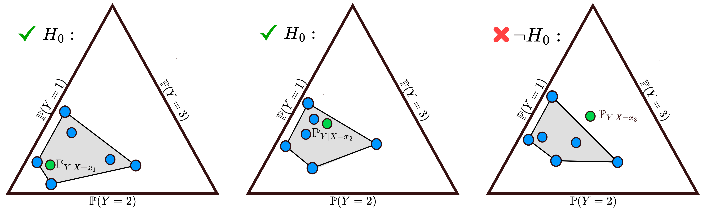

---

##### Download

+ [Paper](https://link.springer.com/article/10.1007/s10994-025-06844-8)
+ [Code](https://github.com/mkjuergens/EnsembleCalibration)

---

##### Abstract

The accurate representation of epistemic uncertainty is a challenging yet essential task in machine learning. A widely used representation corresponds to convex sets of probabilistic predictors, also known as credal sets. One popular way of constructing these credal sets is via ensembling or specialized supervised learning methods, where the epistemic uncertainty can be quantified through measures such as the set size or the disagreement among members. In principle, these sets should contain the true data-generating distribution. As a necessary condition for this validity, we adopt the strongest notion of calibration as a proxy. Concretely, we propose a novel statistical test to determine whether there is a convex combination of the set’s predictions that is calibrated in distribution. In contrast to previous methods, our framework allows the convex combination to be instance-dependent, recognizing that different ensemble members may be better calibrated in different regions of the input space. Moreover, we learn this combination via proper scoring rules, which inherently optimize for calibration. Building on differentiable, kernel-based estimators of calibration errors, we introduce a nonparametric testing procedure and demonstrate the benefits of capturing instance-level variability on synthetic and real-world experiments.

---

##### Figure 2: Hypothesis test setting



---

##### Citation

```latex
@article{jurgens2025calibration,
  title={A calibration test for evaluating set-based epistemic uncertainty representations},
  author={J{\"u}rgens, Mira and Mortier, Thomas and H{\"u}llermeier, Eyke and Bengs, Viktor and Waegeman, Willem},
  journal={Machine Learning},
  volume={114},
  number={9},
  pages={202},
  year={2025},
  publisher={Springer}
}
```

---
