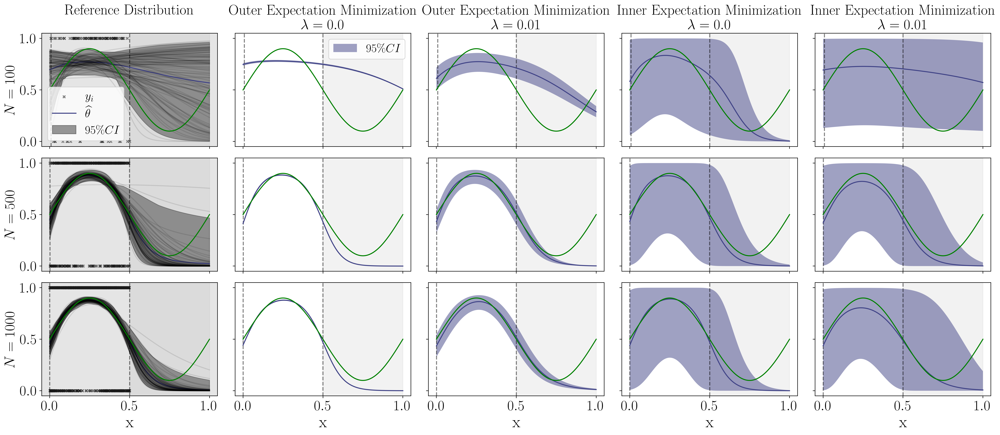

##### Download

+ [Paper](https://proceedings.mlr.press/v235/juergens24a.html)
+ [Code](https://github.com/mkjuergens/EpistemicUncertaintyAnalysis)

---

##### Abstract

Trustworthy ML systems should not only return accurate predictions, but also a reliable representation of their uncertainty. Bayesian methods are commonly used to quantify both aleatoric and epistemic uncertainty, but alternative approaches, such as evidential deep learning methods, have become popular in recent years. This paper presents novel theoretical insights of evidential deep learning, highlighting the difficulties in optimising second-order loss functions and interpreting the resulting epistemic uncertainty measures. With a systematic setup that covers a wide range of approaches for classification, regression, and counts, it provides novel insights into issues arising from loss minimisation for second-order distributions.


---

##### Figure 6: Principle of evidential deep learning of learning a _second-order distribution_



---

##### Citation

Mira Jürgens, Nis Meinert, Viktor Bengs, Eyke Hüllermeier, and Willem Waegeman. 2024. "Is Epistemic Uncertainty Faithfully Represented by Evidential Deep Learning Methods?" *Proceedings of the 41st International Conference on Machine Learning (ICML)*, PMLR 235:22624–22642.

```BibTeX
@inproceedings{juergens2024epistemic,
  title     = {Is Epistemic Uncertainty Faithfully Represented by Evidential Deep Learning Methods?},
  author    = {J{\"u}rgens, Mira and Meinert, Nis and Bengs, Viktor and H{\"u}llermeier, Eyke and Waegeman, Willem},
  booktitle = {Proceedings of the 41st International Conference on Machine Learning},
  pages     = {22624--22642},
  year      = {2024},
  volume    = {235},
  series    = {Proceedings of Machine Learning Research},
  publisher = {PMLR}
}
```
---

##### Related material

+ [Link to presentation](https://icml.cc/virtual/2024/poster/33148)
