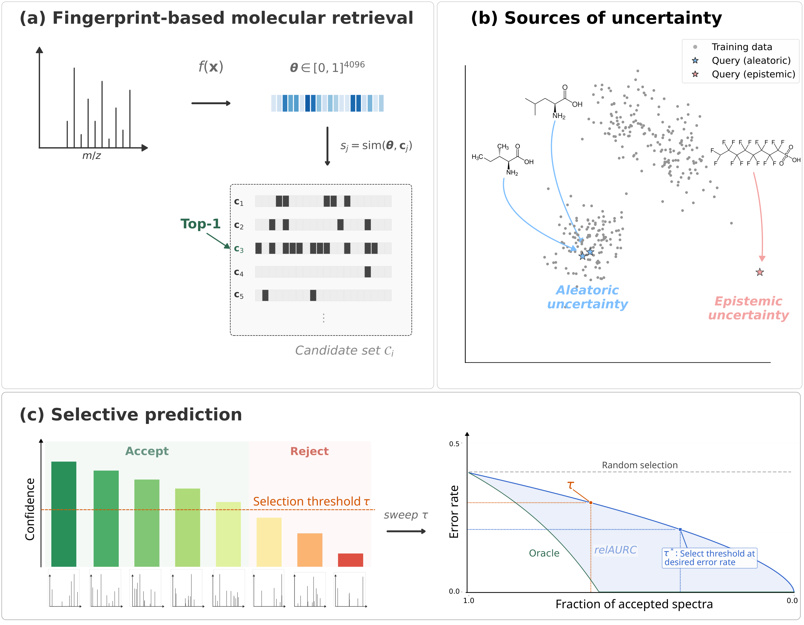

##### Download

+ [Paper]((https://arxiv.org/pdf/2603.10950))
+ [Code](https://github.com/mkjuergens/selective-msms)

---

##### Abstract

Machine learning methods for identifying molecular structures from tandem mass spectra (MS/MS) have advanced rapidly, yet current approaches still exhibit significant error rates. In high-stakes applications such as clinical metabolomics and environmental screening, incorrect annotations can have serious consequences, making it essential to determine when a prediction can be trusted. We introduce a selective prediction framework for molecular structure retrieval from MS/MS spectra, enabling models to abstain from predictions when uncertainty is too high. We formulate the problem within the risk-coverage tradeoff framework and comprehensively evaluate uncertainty quantification strategies at two levels of granularity: fingerprint-level uncertainty over predicted molecular fingerprint bits, and retrieval-level uncertainty over candidate rankings. We compare scoring functions including first-order confidence measures, aleatoric and epistemic uncertainty estimates from second-order distributions, as well as distance-based measures in the latent space. All experiments are conducted on the MassSpecGym benchmark. Our analysis reveals that while fingerprint-level uncertainty scores are poor proxies for retrieval success, computationally inexpensive first-order confidence measures and retrieval-level aleatoric uncertainty achieve strong risk-coverage tradeoffs across evaluation settings. We demonstrate that by applying distribution-free risk control via generalization bounds, practitioners can specify a tolerable error rate and obtain a subset of annotations satisfying that constraint with high probability.

---

##### Figure: Selective prediction framework for molecular structure retrieval from tandem mass spectra



---

##### Citation

Mira Jürgens, Gaetan De Waele, Morteza Rakhshaninejad and Willem Waegeman. "When should we trust the annotation? Selective prediction for molecular structure retrieval from mass spectra". Under review.

```BibTeX
@article{jurgens2026should,
  title={When should we trust the annotation? Selective prediction for molecular structure retrieval from mass spectra},
  author={J{\"u}rgens, Mira and De Waele, Gaetan and Rakhshaninejad, Morteza and Waegeman, Willem},
  journal={arXiv preprint arXiv:2603.10950},
  year={2026}
}
```

