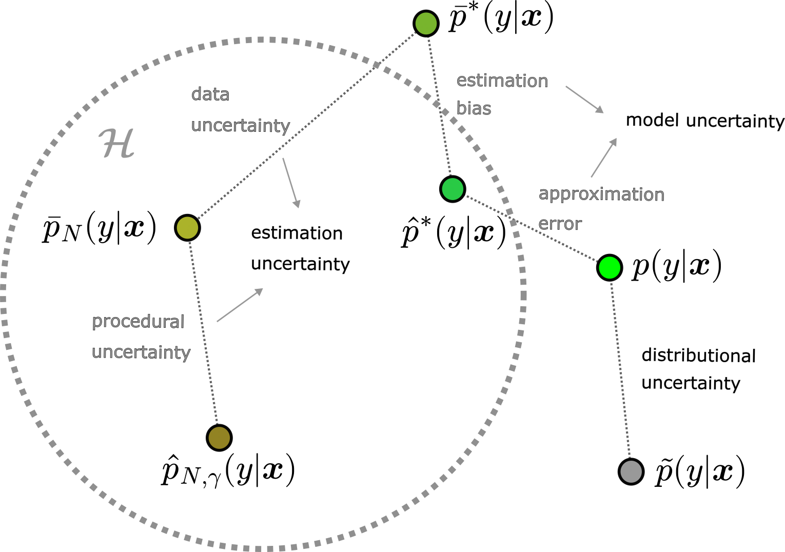

##### Download

+ [Paper](https://arxiv.org/abs/2505.23506)
+ [PDF](https://arxiv.org/pdf/2505.23506)

---

##### Abstract

Identifying and disentangling sources of predictive uncertainty is essential for trustworthy supervised learning. We argue that widely used
second-order methods that disentangle aleatoric
and epistemic uncertainty are fundamentally incomplete. First, we show that unaccounted bias
contaminates uncertainty estimates by overestimating aleatoric (data-related) uncertainty and underestimating the epistemic (model-related) counterpart, leading to incorrect uncertainty quantification. Second, we demonstrate that existing
methods capture only partial contributions to the
variance-driven part of epistemic uncertainty; different approaches account for different variance
sources, yielding estimates that are incomplete
and difficult to interpret. Together, these results
highlight that current epistemic uncertainty estimates can only be used in safety-critical and
high-stakes decision-making when limitations are
fully understood by end users and acknowledged
by AI developers.

---

##### Figure: Sources of epistemic uncertainty in supervised learning



---

##### Citation

Sebastián Jiménez, Mira Jürgens, and Willem Waegeman. 2026. "Position: Epistemic uncertainty estimation methods are fundamentally incomplete." *ICML 2026*.

```BibTeX
@article{jimenez2025machine,
  title={Why machine learning models fail to fully capture epistemic uncertainty},
  author={Jim{\'e}nez, Sebasti{\'a}n and J{\"u}rgens, Mira and Waegeman, Willem},
  journal={arXiv preprint arXiv:2505.23506},
  year={2025}
}
```

